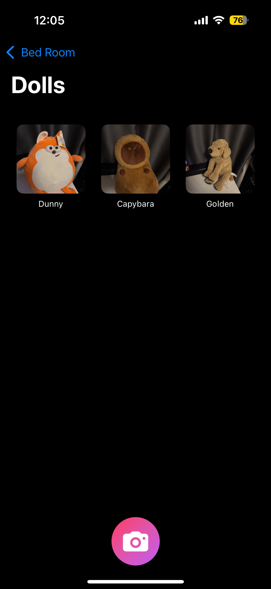
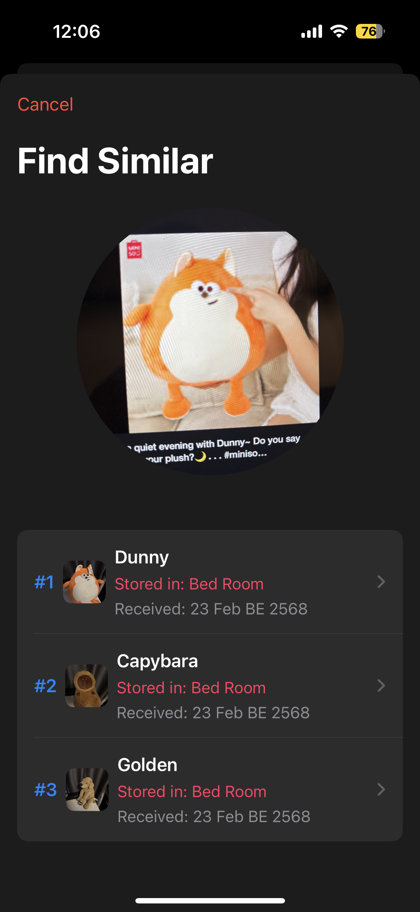
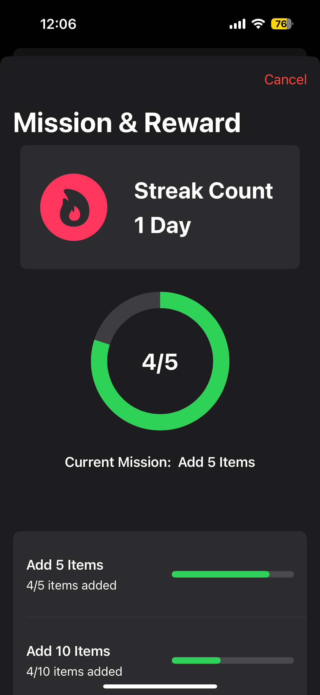

# 🏠 ReKeeper

## 📌 An App to Help You Find Your Belongings at Home  

ReKeeper is a smart and intuitive app designed to help users keep track of where they store their belongings. It is especially useful for elderly individuals with dementia, allowing them to quickly find items through text or image search.  

---

## 🤔 Why Was ReKeeper Created?  

Losing track of stored items is a common problem, especially for elderly individuals with dementia. ReKeeper was developed to reduce confusion and stress by helping users easily locate their belongings.  

This app allows users to **record, categorize, and search** for household items effortlessly. It also promotes better organization habits through engaging features like:  

✅ **Mission & Reward System** – Motivates users with fun challenges.  
✅ **Streak System** – Encourages daily usage by tracking how often users add items.  

---

## 🧠 How Does ReKeeper Help Elderly Users with Dementia?  

1️⃣ **Reduces confusion and stress from losing items**  
   - Quickly locate items through **text search** or **image search**.  

2️⃣ **Assists caregivers in helping elderly users**  
   - Important items like **medications and keys** can be recorded for easy tracking.  

3️⃣ **Encourages memory training and organization**  
   - Recording items helps **reinforce memory** and develop organized storage habits.  
   - The **Mission & Reward System** and **Streak System** encourage consistent engagement.  

4️⃣ **Image Search using Vision Framework**  
   - If a user forgets an item’s name, they can **take a picture of a similar object** to find it.  
   - This feature also helps users **associate names with images** for better memory retention.  

---

## 🔍 How Does ReKeeper Work?  

### 🗂 1. Item Management  
- Users can **create storage locations** (e.g., "Bedroom Closet," "Kitchen Drawer").  
- Items can be **categorized** within each location.  
- Each item is recorded with a **photo, name, and date received**.  
- All data is stored **locally** and can be updated anytime.  

### 🔎 2. Item Search System (Two Methods)  
- **Text Search** – Find an item by typing its name.  
- **Image Search** – Find an item by taking a picture.  
  - Uses **Vision Framework (VNGenerateImageFeaturePrintRequest)** to generate **Feature Vectors**.  
  - Finds the **most similar images** using **Cosine Similarity**.  
  - Displays the **top 3 most similar items** in local storage.  

### 🎯 3. Mission & Reward System  
- Users **complete missions** by recording a set number of items.  
- A **progress bar** tracks how close they are to completing a mission.  

### 🔥 4. Streak System  
- Tracks how many **consecutive days** a user adds new items.  
- A **streak counter** keeps users motivated.  
- Encourages users to **record items daily**.  

---

## 📱 Compatibility  
ReKeeper is designed to be **compatible with iPhone 16** for smooth and efficient performance.  

---

### 📸 Screenshots  
| Collection Page | Image Search | Mission & Streak |  
|-------------|------------|--------------|  
|  |  |  |  

---

This app was built in less than a week.
